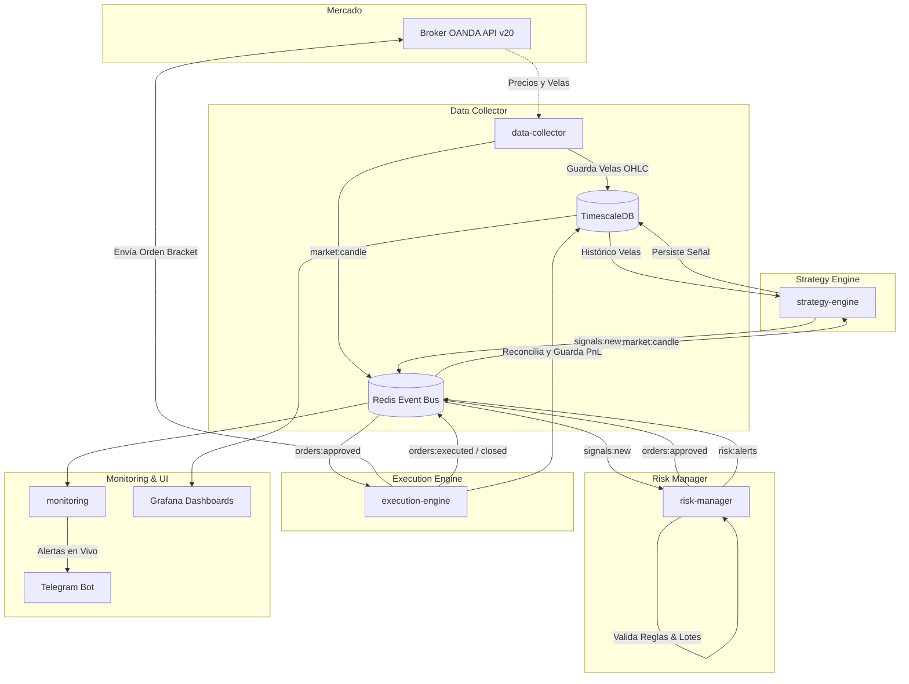

# 🚀 Sistema Profesional de Trading Forex Algorítmico

Plataforma integral y modular de **trading algorítmico y cuantitativo para el mercado Forex** basada en una **arquitectura orientada a eventos (Event-Driven) y microservicios**. Diseñada con Python 3.12+, OANDA REST API v20, TimescaleDB (PostgreSQL para series de tiempo), Redis Pub/Sub, Grafana y Telegram.

---

## 🌟 ¿Qué se puede lograr con este proyecto?

1. **Trading 100% Autónomo 24/5**: Monitoreo y operación continua de múltiples pares de divisas (EUR/USD, USD/JPY, GBP/USD, AUD/USD) en OANDA con ejecución automática en milisegundos.
2. **Gestión de Riesgo Institucional**:
   - Dimensionamiento dinámico de lotes según el balance de cuenta y porcentaje de riesgo (ej. 1% por trade).
   - Stop Loss y Take Profit automáticos vinculados en cada orden.
   - *Circuit Breaker* / *Kill-Switch*: Bloqueo automático de nuevas operaciones si se alcanza el drawdown máximo diario configurado (ej. 5%).
   - Filtros de spread alto y control de sobreexposición por par.
3. **Motor Multi-Estrategia Modular**:
   - **Cruce de Medias Móviles (EMA Crossover)**: Detección de tendencia con filtro EMA 200 y cálculo dinámico de SL/TP mediante múltiplos de ATR.
   - **Reversión a la Media (Bollinger Bands + RSI)**: Captura de rebotes en extremos de sobrecompra/sobreventa.
   - Facilidad para incorporar nuevas estrategias cuantitativas en pocas líneas de código.
4. **Laboratorio de Backtesting Cuantitativo**:
   - Simulación histórica con modelado de comisiones, spreads y slippage.
   - Métricas financieras completas: *Sharpe Ratio, Sortino Ratio, Drawdown Máximo %, Win Rate, Profit Factor, Expectativa Matemática y Curva de Equity*.
   - CLI interactivo y Jupyter Notebook para análisis visual.
5. **Alertas en Tiempo Real por Telegram**: Notificaciones instantáneas con formato Markdown y emojis para cada señal generada, orden enviada al broker, trade cerrado con PnL ($ y pips) y alertas de riesgo.
6. **Observabilidad en Vivo con Grafana**: Dashboards preconfigurados con cotizaciones en tiempo real, balance de cuenta, historial de operaciones y ratio de acierto.

---

## 🏛️ Arquitectura del Sistema



---

## 📁 Estructura del Proyecto

```
forex-trading-system/
│
├── .env.example                     # Plantilla de configuración documentada
├── docker-compose.yml               # Orquestación de producción de todos los servicios
├── docker-compose-dev.yml           # Orquestación de infraestructura local (BD, Redis, Grafana)
├── README.md                        # Documentación principal
│
├── shared/                          # Capa compartida (modelos Pydantic, config, logger, bus)
│   ├── config.py
│   ├── logger.py
│   ├── models.py
│   └── bus.py
│
├── services/
│   ├── data-collector/              # Ingesta periódica de velas OANDA -> TimescaleDB + Redis
│   ├── strategy-engine/             # Cálculo de indicadores técnicos y evaluación de estrategias
│   ├── risk-manager/                # Dimensionamiento de posición y reglas de control de riesgo
│   ├── execution-engine/            # Ejecución de órdenes en broker y reconciliación de SL/TP
│   └── monitoring/                  # Monitoreo de salud y notificaciones en vivo por Telegram
│
├── backtesting/                     # Módulo de investigación cuantitativa y backtesting
│   ├── src/
│   │   ├── data_loader.py           # Cargador desde BD, CSV o generador sintético
│   │   ├── metrics.py               # Fórmulas cuantitativas (Sharpe, Drawdown, Profit Factor)
│   │   ├── engine.py                # Motor de simulación con spreads y comisiones
│   │   └── run_backtest.py          # CLI ejecutable para backtesting
│   └── notebooks/
│       └── explore_strategy.ipynb   # Notebook interactivo de análisis visual
│
├── infra/
│   ├── postgres/init.sql            # Esquema SQL TimescaleDB con hypertables e índices
│   └── grafana/                     # Datasources y Dashboards autoprovisionados
│
└── tests/                           # Suite de pruebas unitarias automatizadas (pytest)
```

---

## ⚡ Inicio Rápido (Quickstart)

### 1. Clonar el Repositorio y Configurar Variables de Entorno

```powershell
cp .env.example .env
```

Edita `.env` con tus credenciales de OANDA y Telegram:
```ini
OANDA_API_KEY=tu_api_key
OANDA_ACCOUNT_ID=tu_account_id
OANDA_ENVIRONMENT=practice  # practice para demo, live para real

FOREX_PAIRS=EUR_USD,USD_JPY,GBP_USD,AUD_USD
CANDLE_GRANULARITY=M5
RISK_PER_TRADE_PCT=1.0

TELEGRAM_BOT_TOKEN=tu_token_de_telegram
TELEGRAM_CHAT_ID=tu_chat_id
```

> **Nota de Simulación**: Si no tienes credenciales de OANDA a mano, puedes dejar `DRY_RUN=true` en `.env` y el sistema correrá en modo simulación automática sin arriesgar capital.

---

### 2. Despliegue con Docker Compose (Recomendado)

Inicia todos los microservicios y la infraestructura con un solo comando:

```powershell
docker compose up -d --build
```

Verifica el estado de los contenedores:
```powershell
docker compose ps
```

Accede al dashboard de monitoreo:
- **Grafana**: [http://localhost:3000](http://localhost:3000) (Usuario: `admin` / Password: `admin`)
- **Dashboard Trading**: Menú `Dashboards` ➔ `Trading` ➔ `Forex Algorithmic Trading Overview`

Para ver los logs en tiempo real:
```powershell
docker compose logs -f monitoring
```

Para detener el sistema:
```powershell
docker compose down
```

---

### 3. Desarrollo Local (Modo Híbrido)

Si prefieres ejecutar y depurar los servicios Python directamente en tu máquina:

1. Levanta la infraestructura de soporte (Base de datos, Redis, Grafana):
   ```powershell
   docker compose -f docker-compose-dev.yml up -d
   ```
2. Instala las dependencias en tu entorno Python:
   ```powershell
   pip install -r services/data-collector/requirements.txt
   pip install -r services/strategy-engine/requirements.txt
   pip install -r services/risk-manager/requirements.txt
   pip install -r services/execution-engine/requirements.txt
   pip install -r services/monitoring/requirements.txt
   pip install -r backtesting/requirements.txt
   ```
3. Ejecuta cualquier servicio individualmente:
   ```powershell
   python services/data-collector/src/main.py
   python services/strategy-engine/src/main.py
   python services/risk-manager/src/main.py
   python services/execution-engine/src/main.py
   python services/monitoring/src/main.py
   ```

---

## 🧪 Laboratorio de Backtesting

Puedes simular el rendimiento de cualquier estrategia contra datos históricos reales o sintéticos:

```powershell
# Ejecutar simulación de Cruce de Medias en EUR/USD con $10,000 iniciales y 1% de riesgo
python backtesting/src/run_backtest.py --pair EUR_USD --strategy ma_crossover --capital 10000 --risk 1.0

# Ejecutar simulación de Reversión a la Media en USD/JPY
python backtesting/src/run_backtest.py --pair USD_JPY --strategy mean_reversion --capital 10000 --risk 1.0
```

### Opciones del CLI de Backtest:
- `--pair`: Par a evaluar (`EUR_USD`, `USD_JPY`, `GBP_USD`, etc.).
- `--strategy`: Estrategia (`ma_crossover` o `mean_reversion`).
- `--capital`: Capital inicial en USD (por defecto `10000`).
- `--risk`: Riesgo por trade en % (por defecto `1.0`).
- `--spread`: Spread simulado en pips (por defecto `1.2`).
- `--candles`: Cantidad de velas a evaluar.
- `--csv`: Ruta opcional a un archivo CSV con datos históricos personalizados.

---

## 🧩 Cómo Crear una Nueva Estrategia

1. Crea un nuevo archivo en `services/strategy-engine/src/strategies/mi_estrategia.py`:
```python
from typing import Optional
import pandas as pd
from shared.models import Signal, SignalDirection
from strategies.base_strategy import BaseStrategy
from indicators import calculate_rsi, calculate_ema

class MiEstrategia(BaseStrategy):
    def __init__(self):
        super().__init__(name="MiEstrategia_RSI")

    @property
    def min_candles_required(self) -> int:
        return 50

    def evaluate(self, df: pd.DataFrame, pair: str) -> Optional[Signal]:
        if not self.validate_dataframe(df):
            return None

        rsi = calculate_rsi(df["close"], 14)
        curr_rsi = rsi.iloc[-1]
        curr_close = df["close"].iloc[-1]

        if curr_rsi < 30:
            return Signal(
                pair=pair,
                strategy_name=self.name,
                direction=SignalDirection.BUY,
                entry_price=curr_close,
                stop_loss=curr_close - 0.0020,
                take_profit=curr_close + 0.0040,
            )
        return None
```
2. Regístrala en `services/strategy-engine/src/main.py` dentro de la lista de estrategias activas.

---

## 🚦 Pruebas Automatizadas

Ejecuta toda la suite de pruebas unitarias para validar indicadores, reglas de riesgo, ejecución y backtester:

```powershell
python -m pytest tests/ -v
```

---

## 🛡️ Seguridad y Buenas Prácticas

- **Nunca commitees tu archivo `.env`** con claves reales de OANDA o tokens de Telegram.
- Comienza siempre en modo `practice` (Demo) hasta comprobar la consistencia de tu estrategia.
- Mantén activas las alertas de Telegram para estar al tanto de cualquier evento en el mercado.
